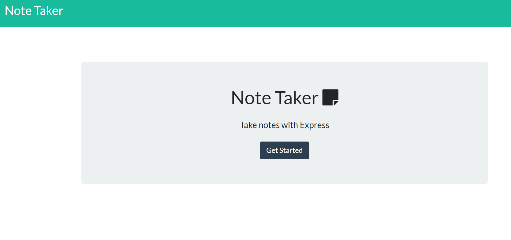

# Express-Note-Taker

In this note-taking app, users are able to save different notes and store them within a file. The user is able to recall the previous notes when the app is started, and update notes if needed. It could be used as a personal journal or reminder list. The notes are saved in an array in JSON format.

## Technologies Used
* HTML, Bootstrap/CSS, Express.js, Node.js, REST API, AJAX

## Links
The app is deployed on Heroku.
* https://murmuring-coast-51649.herokuapp.com
